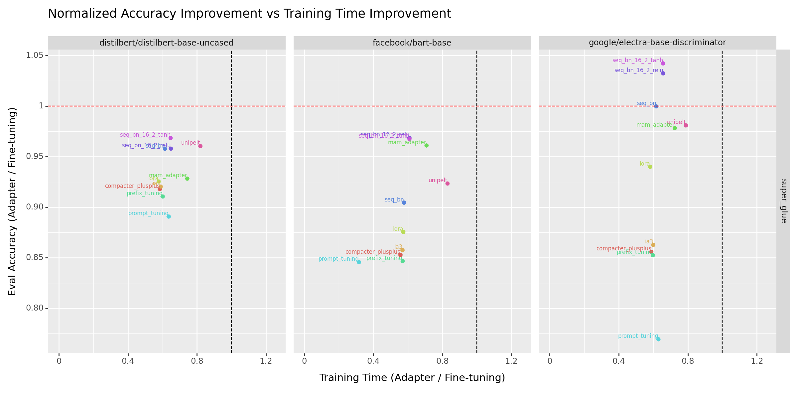

# CS-7643 - Deep Learning - Summer 2024 - Final Project

# Comparative Analysis of Efficient Adapter-Based Fine-Tuning of State-of-the-Art Transformer Models
A capstone project for CS-7643, a graduate-level Deep Learning course at the Georgia Institute of Technology.

## Team
|  No. |        Name        |
|:----:|:------------------:|
|  1.  | Muhammad Ali Sheikh|
|  2.  |   Muhammad Aleem   |
|  3.  |  Saad M. Siddiqui  |
|  4.  |   Kajol R. Singh   |

## Overview
We quantified the tradeoff between performance and training time with [adapter-based fine-tuning](https://adapterhub.ml/blog/2023/11/introducing-adapters/) of three transformer models, specifically BART, DistilBERT, and ELECTRA, on 
1. supervised binary classification tasks from the [SuperGLUE benchmark](https://super.gluebenchmark.com/)
2. supervised multi-class classification on the [Kaggle News Category dataset](https://www.kaggle.com/datasets/rmisra/news-category-dataset)

## Results
Our experiments on SuperGLUE show that adapters achieve up to ~95% of the performance of conventional fine-tuning while requiring upto 40% less training time.

We see similar incremental benefits in training time with little impact to model performance on the Kaggle News Category Classification task.
| Model                           | Adapter        | Eval Loss | Eval Accuracy | Eval F1 Score | Training Time |
|:---------------------------------:|:----------------:|:-----------:|:---------------:|:---------------:|:---------------:|
| google/electra-base-discriminator | None           | 1.3247    | 0.6365        | 0.6246        | 2h 33min       |
| google/electra-base-discriminator | mam_adapter    | 1.3496    | 0.6135        | 0.5962        | 2h 02min       |
| google/electra-base-discriminator | seq_bn_16_2_relu | 1.5746    | 0.5667        | 0.5319        | 1h 55min       |
